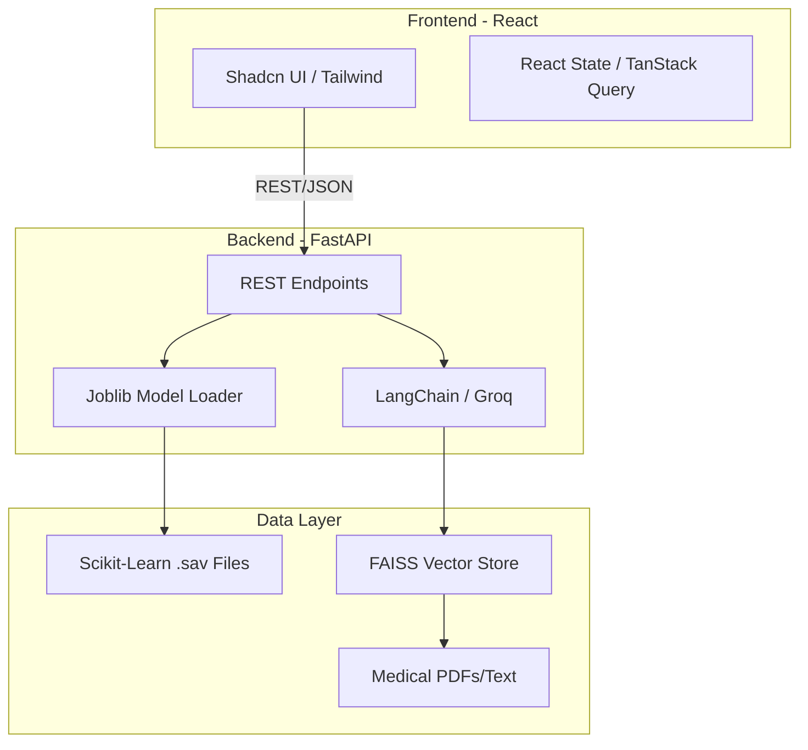

# MediGuard: AI-Powered Health Screening & RAG Assistant

MediGuard is a full-stack clinical decision support system designed for early risk detection of chronic conditions. It integrates traditional machine learning classifiers with a Retrieval-Augmented Generation (RAG) pipeline to provide grounded medical guidance.

## 1. Project Overview
### Problem Statement
Early detection of chronic diseases (Diabetes, Cardiovascular issues, Parkinson's) is often hindered by the lack of accessible, preliminary screening tools. Patients often present symptoms without understanding the clinical markers involved.

### Target Users
- Individuals seeking preliminary health risk assessments.
- Healthcare practitioners looking for a secondary screening tool.
- Medical researchers exploring voice-based biomarkers.

### Key Use Cases
- **Predictive Screening**: Real-time risk estimation for Diabetes, Heart Disease, and Parkinson's using clinical parameters.
- **Grounded Medical Chat**: A RAG-powered chatbot that answers queries using verified medical literature rather than general LLM knowledge.

---

## 2. System Architecture

The system follows a decoupled Client-Server architecture. The backend acts as an inference engine for both deterministic ML models and probabilistic LLM responses.



---

## 3. Backend Architecture
### Layered Structure
- **API Layer (`main.py`)**: Handles request routing, Pydantic validation, and CORS middleware.
- **Service Layer (`rag_engine.py`)**: Encapsulates the logic for document retrieval and LLM orchestration.
- **Utility Layer (`utils.py`)**: Manages singleton instances of ML models to prevent redundant memory allocation.

### Error Handling & Strategy
- **Pydantic Validation**: Strict schema enforcement for clinical inputs (e.g., BMI, Glucose levels).
- **Graceful Degradation**: The system performs health checks on startup. If a specific model file is missing, the API remains functional but returns a `503 Service Unavailable` for that specific endpoint.

---

## 4. Data & Knowledge Design
### Predictive Models
- **Diabetes**: Trained on Pima Indians Diabetes Database.
- **Heart Disease**: Trained on Cleveland Clinic Foundation dataset.
- **Parkinson's**: Utilizes acoustic biomarkers (Jitter, Shimmer, HNR) for voice-based detection.

### Vector Database (RAG)
- **Engine**: FAISS (Facebook AI Similarity Search).
- **Embeddings**: `sentence-transformers/all-MiniLM-L6-v2` for high-density semantic representation.
- **Retrieval Strategy**: Similarity search with a distance threshold (< 0.65) to ensure only highly relevant medical context is passed to the LLM.

---

## 5. API Documentation

### Major Endpoints
| Method | Endpoint | Description |
| :--- | :--- | :--- |
| `GET` | `/health` | Returns status of all ML models and RAG engine. |
| `POST` | `/predict/diabetes` | Predicts diabetes risk based on 8 clinical markers. |
| `POST` | `/predict/heart` | Predicts cardiac risk based on 13 markers. |
| `POST` | `/chat` | RAG-powered endpoint for medical queries. |

### Sample Request (`/predict/diabetes`)
```json
{
  "Pregnancies": 2,
  "Glucose": 138,
  "BloodPressure": 62,
  "SkinThickness": 35,
  "Insulin": 0,
  "BMI": 33.6,
  "DiabetesPedigreeFunction": 0.127,
  "Age": 47
}
```

---

## 6. Frontend Architecture
- **Component Strategy**: Atomic design using **Shadcn UI**. Every component is modular and styled with Tailwind CSS for responsive layouts.
- **State Management**: Local state for form handling; **TanStack Query** for server-state synchronization and caching.
- **API Integration**: Centralized `apiClient` using Axios with environment-based base URLs.

---

## 7. Performance & Scalability
- **Inference Latency**: FastAPI's asynchronous nature allows handling concurrent requests without blocking the event loop during LLM I/O.
- **Model Loading**: Models are pre-loaded into memory on startup (Singleton pattern) to ensure sub-millisecond prediction times.
- **Horizontal Scaling**: The stateless nature of the FastAPI backend allows it to be containerized and scaled across multiple nodes using a Load Balancer.

---

## 8. Security Considerations
- **CORS Configuration**: Restricted to specific origins via environment variables.
- **Input Sanitization**: Pydantic ensures no malicious payloads are processed by the ML models.
- **Data Privacy**: No Patient Health Information (PHI) is persisted in the current version, ensuring compliance with basic privacy standards.

---

## 9. Setup Instructions

### Environment Variables
Create a `.env` file in the root:
```env
VITE_API_URL=http://localhost:8000
GROQ_API_KEY=your_groq_key_here
```

### Backend Setup
```bash
cd backend
pip install -r requirements.txt
python main.py
```

### Frontend Setup
```bash
npm install
npm run dev
```
