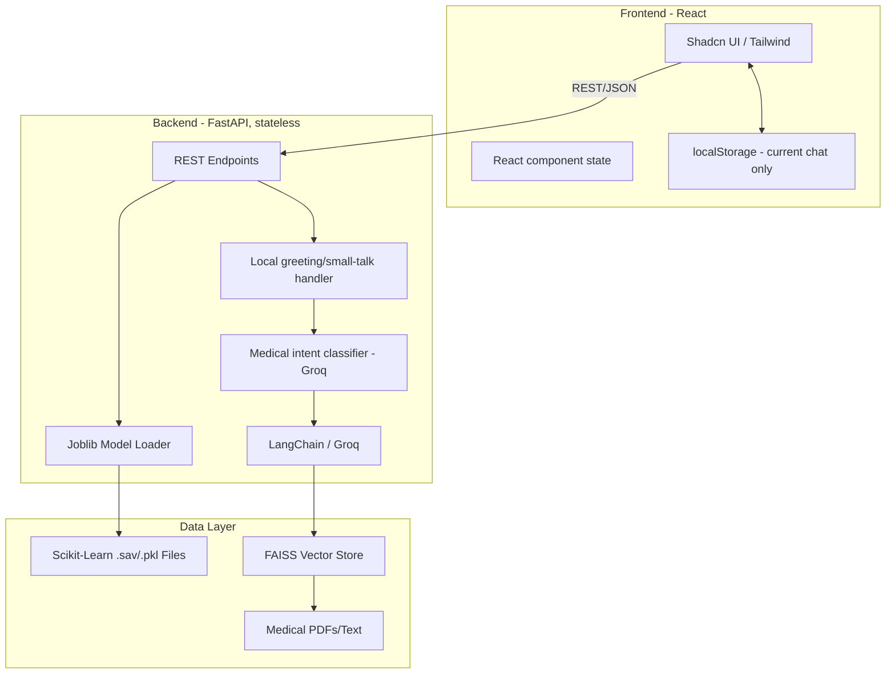

# MediGuard: AI-Powered Health Screening & RAG Assistant

MediGuard is a full-stack clinical decision support system built around a Retrieval-Augmented Generation (RAG) medical assistant, with statistical disease-risk screening as a secondary tool. It integrates traditional machine learning classifiers with a RAG pipeline to provide grounded medical guidance rather than open-ended LLM output.

## 1. Project Overview
### Problem Statement
Early detection of chronic diseases (Diabetes, Cardiovascular disease, Parkinson's, Breast Cancer, Chronic Kidney Disease) is often hindered by the lack of accessible, preliminary screening tools. Patients often present symptoms without understanding the clinical markers involved, or don't have an easy way to ask a follow-up question about what a result actually means.

### Target Users
- Individuals seeking preliminary health risk assessments or plain-language answers to health questions.
- Healthcare practitioners looking for a secondary screening tool.
- Medical researchers exploring voice-based biomarkers.

### Key Use Cases
- **Grounded Medical Chat**: A RAG-powered assistant, and the app's primary experience, that answers health questions using retrieved medical literature where available rather than general LLM knowledge — and is explicit in the UI about whether a given answer is grounded in that literature or is general guidance.
- **Predictive Screening**: Real-time risk estimation for Diabetes, Heart Disease, Parkinson's, Breast Cancer, and Chronic Kidney Disease using clinical parameters — presented as a secondary "Health Screening" toolset, not the app's main focus.
- **Screening → Assistant handoff**: Each screening result includes a CTA that opens the assistant with a pre-filled, contextual question about what that specific result means (explicitly framed as risk estimation, never as diagnosis).

---

## 2. System Architecture

The system follows a decoupled Client-Server architecture. The backend acts as an inference engine for both deterministic ML models and probabilistic LLM responses; the frontend is fully stateless server-side, using the browser's `localStorage` only for local chat continuity.



### Frontend routing / information architecture
- `/` — the RAG Assistant (primary experience): a full chat interface, `ChatConversation`, shared by both the home page and a floating widget shown on other pages.
- `/screening` — a secondary hub listing the five disease-risk tools.
- `/diabetes`, `/heart`, `/parkinsons`, `/cancer`, `/kidney` — individual screening forms; each result includes a CTA back to the Assistant with a pre-filled contextual question.
- `/chat` — redirects to `/` (kept for any existing bookmarks).

---

## 3. Backend Architecture
### Layered Structure
- **API Layer (`main.py`)**: Handles request routing, Pydantic validation, and CORS middleware. `/chat` runs the RAG pipeline in a threadpool (`run_in_threadpool`) so a single in-flight Groq/FAISS call doesn't block the event loop for other concurrent requests.
- **Service Layer (`chatbot/rag_engine.py`)**: Encapsulates document retrieval and LLM orchestration, in three stages per message:
  1. **Local small-talk handler** — an exact-match, no-LLM lookup for greetings and basic conversational filler ("hi", "thanks", "bye", etc.), so these never reach Groq or FAISS at all.
  2. **Medical intent classifier** — a Groq call that gates everything else; fails closed (rejects) if Groq is unavailable or the call errors.
  3. **Retrieval + generation** — FAISS similarity search followed by a Groq generation call, constrained to return structured JSON.
- **Utility Layer (`utils.py`)**: Manages singleton instances of ML models to prevent redundant memory allocation.

### Error Handling & Strategy
- **Pydantic Validation**: Strict schema enforcement for clinical inputs (e.g., BMI, Glucose levels).
- **Graceful Degradation**: The system performs health checks on startup. If a specific model file is missing, the API remains functional but returns a `503 Service Unavailable` for that specific endpoint.
- **Defensive response shaping**: the LLM's own JSON output is not trusted as-is — `get_response()` coerces missing/malformed fields to safe defaults before returning, so a malformed model response can't crash the caller. Every `/chat` response path (including small talk, rejection, initializing, and error cases) returns a fully deterministic shape.

---

## 4. Data & Knowledge Design
### Predictive Models
- **Diabetes**: Trained on the Pima Indians Diabetes Database.
- **Heart Disease**: Trained on the Cleveland Clinic Foundation dataset.
- **Parkinson's**: Utilizes acoustic biomarkers (Jitter, Shimmer, HNR) for voice-based detection.
- **Breast Cancer**: Trained on the Wisconsin Breast Cancer dataset (cell-nuclei measurements).
- **Chronic Kidney Disease**: Trained on clinical/lab markers (blood pressure, albumin, serum creatinine, etc.).

### Vector Database (RAG)
- **Engine**: FAISS (`IndexFlatL2`), built from the Gale Encyclopedia of Medicine.
- **Embeddings**: `sentence-transformers/all-MiniLM-L6-v2`, unit-normalized (`normalize_embeddings=True`) — FAISS reports *squared* L2 distance over these vectors, not plain Euclidean distance or cosine similarity directly.
- **Retrieval Strategy — hybrid, two separate thresholds for two separate purposes**:
  - The **top 3** nearest chunks are always passed to the LLM as candidate context, regardless of distance — the generation prompt explicitly instructs the model that this context may not be relevant and must only be used if it actually supports the answer.
  - Only chunks scoring below `EVIDENCE_DISTANCE_THRESHOLD = 1.0` (empirically tuned against real queries) are surfaced to the user as cited evidence and count toward the response's `grounded` flag — a stricter, precision-favoring bar, since showing a weak match as "evidence" would undermine trust rather than support it.
- **LLM**: Groq-hosted `openai/gpt-oss-20b`, called with `reasoning_effort="low"` and a token budget sized to accommodate its (hidden) reasoning tokens, which still count against `max_tokens` even though they don't appear in the response content.

---

## 5. API Documentation

### Endpoints
| Method | Endpoint | Description |
| :--- | :--- | :--- |
| `GET` | `/` | Basic status check. |
| `GET` | `/health` | Returns load status of all ML models and the RAG engine. |
| `POST` | `/predict/diabetes` | Predicts diabetes risk based on 8 clinical markers. |
| `POST` | `/predict/heart` | Predicts cardiac risk based on 13 markers. |
| `POST` | `/predict/parkinsons` | Predicts Parkinson's risk from 22 acoustic voice features. |
| `POST` | `/predict/cancer` | Predicts breast cancer risk from 26 cell-nuclei measurements. |
| `POST` | `/predict/kidney` | Predicts chronic kidney disease risk from 18 clinical markers. |
| `POST` | `/chat` | RAG-powered endpoint for medical queries and conversational small talk. |

### Sample Request (`/predict/diabetes`)
```json
{
  "Pregnancies": 2,
  "Glucose": 138,
  "BloodPressure": 62,
  "SkinThickness": 35,
  "Insulin": 0,
  "BMI": 33.6,
  "DiabetesPedigreeFunction": 0.127,
  "Age": 47
}
```
Response: `{ "prediction": 0 | 1 }`

### Sample Request/Response (`/chat`)
```json
// Request
{ "message": "I feel fever, what should I do?" }
```
```json
// Response
{
  "response": {
    "summary": "A fever is usually the body fighting infection. Rest and fluids are typically recommended.",
    "what_to_try": [
      "Rest and stay hydrated.",
      "Take an over-the-counter antipyretic like acetaminophen if uncomfortable."
    ],
    "seek_care_if": [
      "Fever higher than 104°F (40°C) or lasting more than 48 hours.",
      "Difficulty breathing, confusion, or a stiff neck."
    ],
    "sources": ["Fever Definition: A fever is any body temperature elevation over 100°F (37.8°C)…"],
    "grounded": true,
    "conversational": false
  }
}
```
`sources`/`grounded` are omitted-as-empty/false when no passage clears the evidence threshold. `conversational: true` (with empty `what_to_try`/`seek_care_if`/`sources`) marks a local small-talk reply, which never touched Groq or FAISS — the frontend uses this flag to suppress the grounding indicator for those messages.

---

## 6. Frontend Architecture
- **Component Strategy**: Shadcn UI + Tailwind CSS, restrained/professional styling (no gradients, glassmorphism, or heavy shadows) rather than a generic "AI SaaS" look.
- **RAG Assistant (`components/chat/ChatConversation.tsx`)**: the single shared chat implementation used both by the full-page Assistant (`/`) and the floating widget shown elsewhere — message rendering, sending, the grounding indicator, and conversation persistence all live here so both surfaces stay in sync.
- **Chat persistence**: the current conversation (including structured responses, `sources`, `grounded`, `conversational`, and timestamps) is persisted to `localStorage` (`src/lib/chatStorage.ts`) and restored on reload; a "New conversation" control (confirmed via a shadcn `AlertDialog` when there's an existing conversation) clears it. This is local-only — nothing about chat history is sent to or stored by the backend.
- **State Management**: local component state for forms and chat; `@tanstack/react-query`'s provider is present but not currently used for data fetching — API calls go through a centralized Axios client instead.
- **API Integration**: Centralized, fully-typed `apiClient` (`src/api/client.ts` + `src/api/types.ts`) using Axios with an environment-based base URL.

---

## 7. Performance & Scalability
- **Inference Latency**: `/chat` runs its Groq/FAISS work via `run_in_threadpool`, so FastAPI's event loop stays free to handle other concurrent requests during LLM I/O rather than serializing them behind a single in-flight call.
- **Model Loading**: Models, embeddings, and the FAISS index are pre-loaded into memory on startup (singleton pattern) to ensure fast prediction and retrieval times.
- **Horizontal Scaling**: The backend is fully stateless — no server-side session or conversation state — so it can be containerized and scaled across multiple nodes behind a load balancer without any shared-state coordination.

---

## 8. Security Considerations
- **CORS Configuration**: Restricted to specific origins via the `ALLOWED_ORIGINS` environment variable.
- **Input Sanitization**: Pydantic ensures no malicious payloads are processed by the ML models.
- **Data Persistence**: The backend itself persists nothing — no database, no server-side session or conversation storage. The current chat conversation is persisted **client-side only**, in the browser's own `localStorage`, so a user can refresh without losing context; a visible "New conversation" control clears it, and the UI carries a small note that history is stored locally on-device. No account system or cross-device sync exists, and this is not intended as a HIPAA-compliant PHI storage mechanism — treat it as no different from any other browser-local UI state.

---

## 9. Setup Instructions

### Environment Variables
Two separate `.env` files — this matters because `python-dotenv` resolves relative to the backend's own working directory, not the project root:

Root `.env` (read by Vite):
```env
VITE_API_URL=http://localhost:8000
```

`backend/.env` (read by the FastAPI app):
```env
GROQ_API_KEY=your_groq_key_here
ALLOWED_ORIGINS=http://localhost:8080
```

### Backend Setup
```bash
cd backend
pip install -r requirements.txt
python main.py
```

### Frontend Setup
```bash
npm install
npm run dev
```
